# 
Men's 100m Sprint Historical Analysis Report

Calder Glass  

Department of Statistics and Data Science  
University of California, Santa Barbara   
93117-5152  
Santa Barbara, CA  
calderglass@ucsb.edu

June 12th, 2026

##### 

## Abstract

***

The 100 meter dash is the most notable event in Track & Field. At the same time, it's difficult to get a comprehensive record of results in the event.This report attempted to construct that record by collecting the data from the Track and Field statistics site known as Tilastopaja and forecast 100 meter times as well. A formula was used to correct the results for wind and altitude while the dates of each performance were converted into the 'datetime64' format required for a time series. Two datasets were constructed through resampling for weeks and months respectively. Both datasets were tested for stationarity through the Augmented Dickey Fuller (ADF) and Kwiatkowski–Phillips–Schmidt–Shin (KPSS) tests. Auto Regressive Integrated Moving Average (ARIMA), Seasonal Auto Regressive Integrated Moving Average (SARIMA), and Recurrent Neural Networks (RNN) models were fitted to the datasets and the performances of the metrics were recorded with the Root Mean Squared Error (RMSE) metric. The univariate SARIMA model fitted on the time series with a monthly resampling performed the best with an RMSE of 0.1120. Further modifications to the existing models or new models will be tested for any potential performance improvement.

***

## Introduction

***

The 100 meter dash is an event in Track & Field where 8 to 10 athletes react to a starter's pistol and run 100 meters to a finish line. The version of the event with all male athletes is the 'marquee event' of Track & Field with the most viewers watching at high level competitions like the World Championships or Olympic Games. Outside of the aforementioned meets, male sprinters in the 100 meter dash run a mix of professional league, amateur, and national championship meets in order to have the chance to even reach the level of the World Championships or Olympic Games. 

As a result, these prior meets are significant in understanding how a given sprinter has become competitive at the world-level in the 100 meter dash. Unfortunately for the history of the event, not all performances are accredited with the same recognition by the governing body of Track & Field, World Athletics. In the present day, meet organizers have to register their meets with World Athletics in order for the performances to be recognized. When this responsibility isn't met, the athletic profiles of sprinters on World Athletics have [omissions](#references) for results that were otherwise legal, such as Tate Taylor's national under-20 100 meter dash record of [9.92 seconds](#references) at the 2025 UIL Texas State Track and Field Championships. World Athletics' record keeping has also struggled with past data, with results such as the 1995 USATF Men's 100 Meter Dash Final, despite meet documentation of those results having taken place. 

This project attempted to not only look at a more comprehensive history of the event, but to use that larger breadth of data in order to forecast sprint performances. The first task was done through acquiring data from [Tilastopaja](#references), a Track & Field statistics site, via a paid subscription. To forecast future results in the 100 meter dash, a variety of models were deployed.

A challenge that became apparent during the Methodology section of this report was the data's properties being incompatible with traditional time series models such as ARIMA or SARIMA. In particular, results from 1948 to 1956 were particularly sparse. After removal of sprints with no proper wind readings, altitudes, or placements, some of the aforementioned years did not have any 100 meter results to speak of. Even after 1956, there was still an issue of results being predominantly located in the third quarter of the year (July to September). Consequently, resampling the data to create a monthly frequency resulted in missing results, which would make it impossible to produce a performance metric such as the Root Mean Square Error (RMSE). 

***

## Data

***
The dataset of sprint performances is a combination of subsets of JSON files from [Tilastopaja](#references). Tilastopaja is a Track & Field statistics site hosted in Finland by Mirko Jalava since 1993. The site offers a paid subscription, which allows for users to access 'Deep Year Lists' that contain results for any Track & Field event for the given year. Through inspecting the website with Firefox, JSON files containing all men's 100 meter results from 1949 to 2025 were acquired. A python script, 'sprintDataScrape.py', was constructed to read each JSON file and extract both the 'wind-legal' and 'wind-aided' tables of performances, where wind-legal results have a maximum allowable wind-reading of 2.0 meters per second, whereas wind-aided results have more than 2.0 meters per second of wind.

While wind-aided marks are [not eligible](#references) for record purposes, they can occur in both regular-season and championship level meets. Additionally, some of the venues where 100 meter races are held do not have the luxury of an enclosed stadium to block out strong tailwinds. Thus, the decision was made to include wind-aided results for accurate bookkeeping of sprinters' career progression in the dataset. 

A major goal of this report was to try to compare the raw performances of sprinters. Conditions like altitude and wind speed are [beneficial](#references) for faster times. In order to control these factors, the variable 'time-corrected' was constructed using the following [formula](#references) to correct 100 meter times to a condition of 0 meters of altitude and 0.0 m/s of wind.
$$t_{w,h} * (1.027 - 0.027 * e^{-0.000125 * h} * (1 - ((w * t_{w,h}) / 100))^{2})$$

In this formula, $t_{w,h}$ is the 100 meter sprint time with the given altitude and wind speed, $h$ is the altitude in meters, and $w$ is the wind speed in meters per second. In order to supply the altitudes necessary for time correction, the venues of the performances were inputted into the [Geocoding API](#references) to extract latitude and longitude coordinates, which were then inputted into the [Free Elevation API Service](#references) to extract the altitudes in meters. 

The 'time-corrected' column was also used as an input for 'PersonalBest-Corrected' and 'SeasonalBest-Corrected' variables. These variables sort by the name of the sprinter and the date of their performance, then group by the name again in order to perform the Pandas 'cummin' function on the 'time-corrected' variable. These variables are significant to recording the progression of sprinters' performances because wind-aided times can be properly compared with wind-legal times. The 'corrected' variants of the 'PersonalBest' and 'SeasonBest' variables provide more data, which gives greater insight into how a 100 meter sprinter could've gone on to run a faster personal best or season best in the event.

The dates of the performances were converted from strings to 'datetime64' objects using the 'to_datetime' function from the Pandas package on the 'date' variable. This prepares each result for ARIMA Time Series analysis as the time input is supposed to be in the timestamp data type.

After the necessary variables were constructed, the data consisted of 389102 sprint performances and 28 predictors.
***

## Methodology

***

Data was read into the script 'sprintAnalysis.py'. Data science packages such as statsmodels, keras, skforecast, matplotlib, and plotly were included to execute the aforementioned models and visualize the discrepancies between forecasted times and actual times. Due to the scale of the data, graphing the time series caused the plotly package to crash. The performances were infrequent, especially in the first 10 years where races are sparse and harder to find historical records. As a result, two new datasets were created: 'monthly_minimum' and 'weekly_minimum'. The dimensions of the datasets consisted of 930 and 4040 performances respectively. Indexes for both datasets were set to the dates of the performances and were resampled into months and weeks respectively. Time interpolation followed by forwards and backwards fill methods were employed to simulate results when there were none. 

After time interpolation was complete, initial graphs were produced of the monthly and weekly resamplings of the data. To satisfy the first models, Auto Regressive Integrated Moving Average (ARIMA) and Seasonal Auto Regressive Integrated Moving Average (SARIMA), stationarity tests such as Augmented Dickey Fuller (ADF) and Kwiatkowski–Phillips–Schmidt–Shin (KPSS) were performed. Autocorrelation and Partial-Autocorrelation functions were performed on the 'time-corrected' column for both datasets in order to identify the *p* and *q* orders for the ARIMA and SARIMA models. The *p* order number corresponds to the lag number where the greatest decrease in partial-autocorrelation occurs, while the *q* order number corresponds to the lag number where the greatest decrease in autocorrelation occurs. For the aforementioned models, 'monthly_minimum' and 'weekly_minimum' were split into 80% training data and 20% testing data. The SARIMA model was only deployed on the monthly fastest times while the ARIMA model was deployed on both sets of fastest performances. Based on the results of the ADF and KPS tests, a differencing order of 1 was applied to the ARIMA model and tested in a number of combinations for the SARIMA model. Additionally, the SARIMA model was also tested with wind and altitude as exogenous/extra variables in order to test for any decrease in forecasting error when accounting for those factors in sprints. The SARIMA model's last test involved removing observations from before January 1st, 1960, for the purpose of removing some of the interpolative noise from the monthly training data. 

After the results of the SARIMA models were recorded, a Recurrent Neural Network (RNN) model was constructed on the weekly time series. A Long Short Term Memory (LSTM) layer was chosen for the recurrent layer and the model was used as an estimator in the *ForecasterRNN()* object. The weekly data was split into 80% training, 10% validation, and 10% testing. After running the initial predictions and fitting the forecaster on the training data, backtesting to refine the model was performed using the epoch before the epoch with the lowest validation loss. The root mean squared error was recorded as it represents the same units in seconds as the sprint times themselves, thus being the 'gap' in an actual 100 meter race. A number of follow up tweaks were performed including disabling refitting, changing the number of units in the dense layer from 64 to 128, tweaking the number of lags from 32 to 40, adding an exponential linear unit (ELU) activation function and subsequently another recurrent layer, adding more units to the dense/output layer, and a combination of some of the above tests. Each test's RMSE was recorded in order to determine which changes most significantly improved the performance of the model. 

The last model to be tested was an Exponential Smoothing model on the monthly time series. The data was split the same as the prior models and a *seasonal_periods = 12* parameter was added. Like the other models, an RMSE was also recorded for measuring performance in terms of seconds.

***

## Results

***

The summary statistics of the weekly and monthly sprint time series data were similar for the faster times but varied more with slower times. Both datasets had a minimum time-corrected 100 meter time of 9.623, which is a correction of the 100 meter world record of 9.58. The weekly data had mean and median performances of 10.333 and 10.332 seconds respectively, which was slower than the monthly data's mean and median performances of 10.258 and 10.251 seconds. The differences became more apparent in the quartiles, where the weekly time series had lower and upper quartile times of 10.144 and 10.521 seconds to the monthly time series' 10.042 and 10.453 seconds. The contrast between the two datasets peaked with the maximum/slowest times, where monthly data had the slowest time at 11.149 seconds to the weekly data's 10.887 seconds.

After constructing the datasets for the fastest times each week and the fastest times each month, basic time series plots were graphed.

| Weekly Time Series     | Monthly Time Series    |
| ---------------------- | ---------------------- |
| 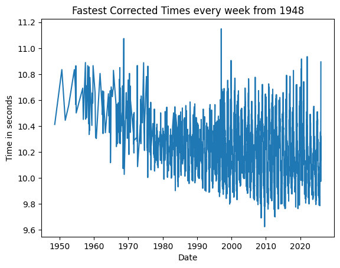| 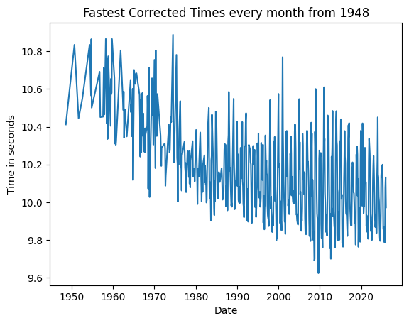|

The weekly sprint data isn't as sparse as the monthly data due to the higher frequency of resampling, but there is a clear negative trend from approximately 1958 onward. This trend was further confirmed after the Augmented Dickey Fuller (ADF) and Kwiatkowski–Phillips–Schmidt–Shin (KPSS) tests were performed on both datasets.

| Frequency of Time Series | Stationary Test | P-Value |
| --------| -----| -------- |
| Weekly  | ADF  | 0.000015 |
| Weekly  | KPSS | < 0.01
| Monthly | ADF  | 0.331698 
| Monthly | KPSS | < 0.01

In the ADF tests, p-values less than $\alpha = 0.05$ rejected the null hypothesis that a given time series had a unit root, which describes a time series with a non-constant mean and variance, thus not being stationary. In the KPSS tests however, p-values less than $\alpha = 0.05$ rejected the null hypothesis that a given time series was trend-stationary, thus suggesting that it was non-stationary. Thus, the weekly dataset demonstrated that the weekly fastest sprint times did not have a unit root but weren't trend statinoary, while the monthly dataset showed that the monthly fastest sprint times did not have a unit root and weren't trend stationary, which solidified the decision to difference both time series.

Before training the ARIMA and SARIMA models, the autocorrelation and partial autocorrelation functions were plotted in order to identify significant lags/time deltas where the largest decreases in autocorrelation and partial autocorrelation occurred respectively. 

| Weekly Time Series     | Monthly Time Series    |
| ---------------------- | ---------------------- |
| 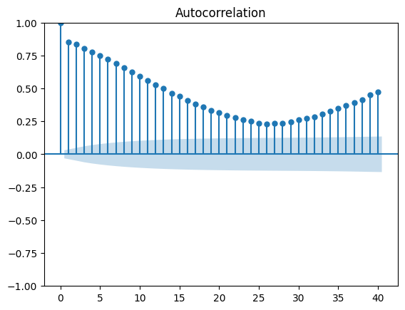| 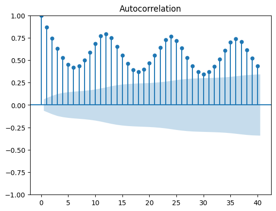|
| 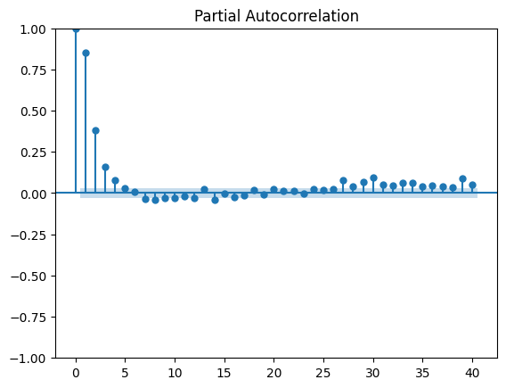| 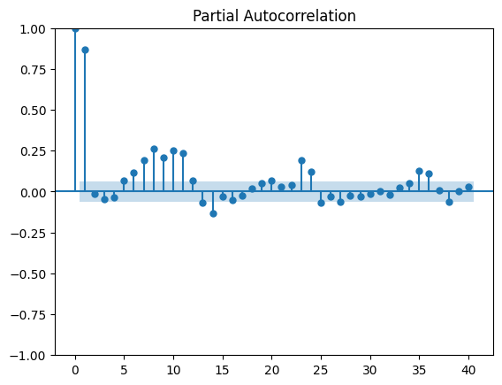|

The weekly time series had its most significant dropoff in autocorrelation at the 1st lag, which also occurred for the monthly time series. In terms of the partial autocorrelations, both the monthly and weekly time series exhibited the biggest drop at the 2nd lag. Additionally, the monthly time series in particular showed seasonality every 12 lags, starting from lag 6. The autocorrelation and partial autocorrelation plots may have needed more lags in order to see the weekly seasonality. 

After splitting the two datasets into 80% training and 20% testing each, ARIMA $(p,d,q)=$ ARIMA $(2,1,1)$ models were fitted onto the training times before forecasting the remaining 20% of the sprint times.

| Weekly Time Series     | Monthly Time Series    |
| ---------------------- | ---------------------- |
| 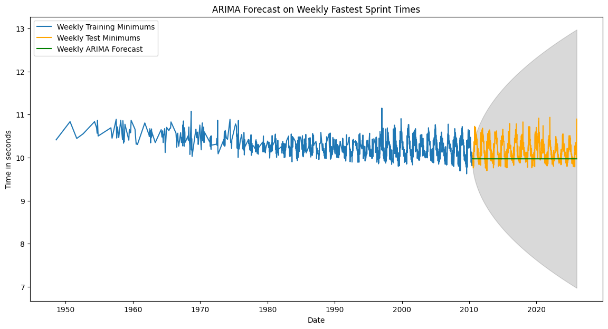| 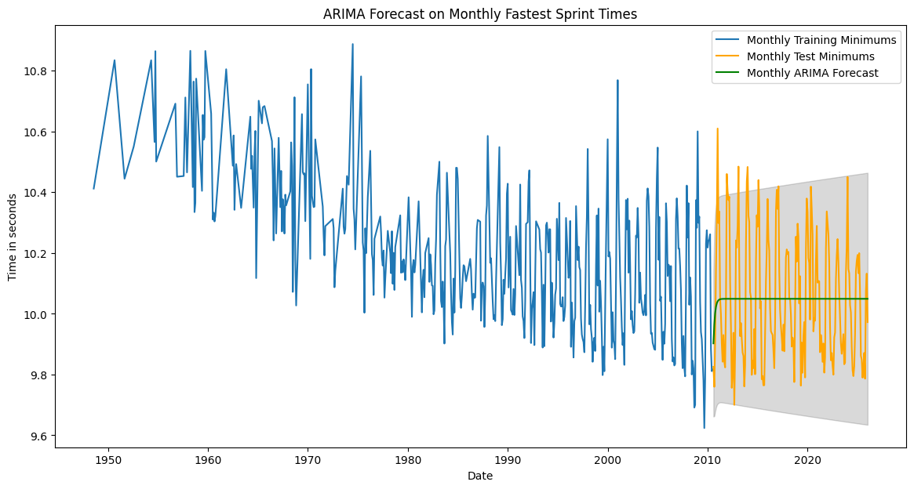|

The root mean squared errors of the two time series on the ARIMA model were also recorded.

| Frequency of Performances     | Root Mean Squared Error (RMSE)|
| ---------------------- | ---------------------- |
| Weekly Time Series| 0.3116|
| Monthly Time Series| 0.2010|

The measure of the average difference in seconds between the true fastest 100 meter times for each week and the forecasted times was 0.3116 seconds, while the difference between the true fastest 100 meter times for each month and the forecasted times was 0.2010 seconds.

The SARIMA models were ran on the monthly time series data only as the monthly data had the lower RMSE of the two.

The first SARIMA model was univariate, with no additional predictors to attempt to improve performance. It was attempted with different configurations of differencing, as the SARIMA model has a regular difference term 'd' and a seasonal difference 'D' term. The model with the best performance had a regular difference term and no seasonal difference term.

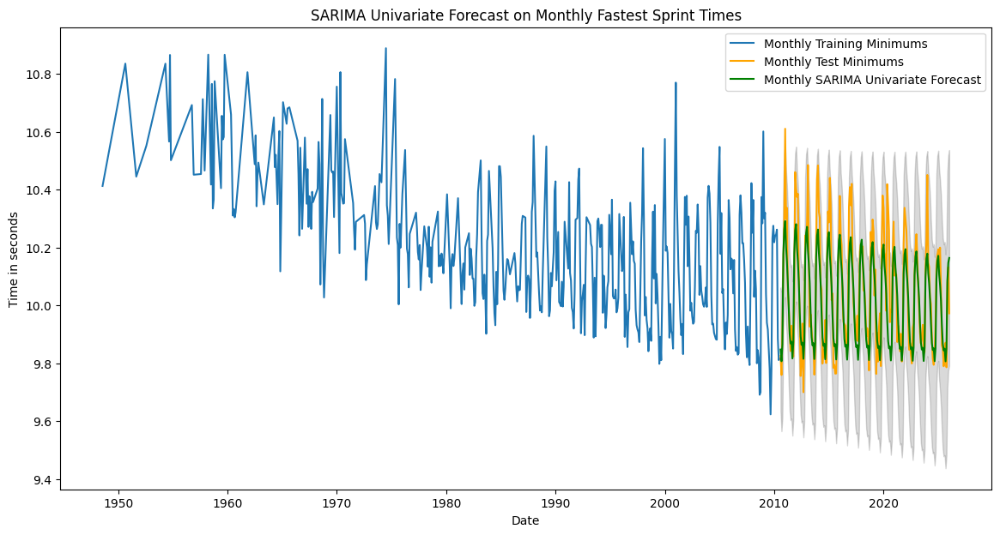

The root mean squared errors with all the differencing configurations attempted are provided below.

| Differencing Configuration     | Root Mean Squared Error (RMSE)|
| ---------------------- | ---------------------- |
| $D = 1,\ d = 1$ | 0.1219|
| $D = 0,\ d = 0$| 0.1213|
| $D = 0,\ d = 1$| 0.1120|
| $D = 1,\ d = 0$| 0.1125|

The next SARIMA model was exogenous, where the 'wind' and 'altitude' predictors were included in the model to test for any performance improvements. In contrast to the 'time-corrected' column, these predictors were interpolated barycentrically so as to stay close to existing wind speeds and altitudes. The same configurations of differencing terms were tested with this model as with the univariate SARIMA model.

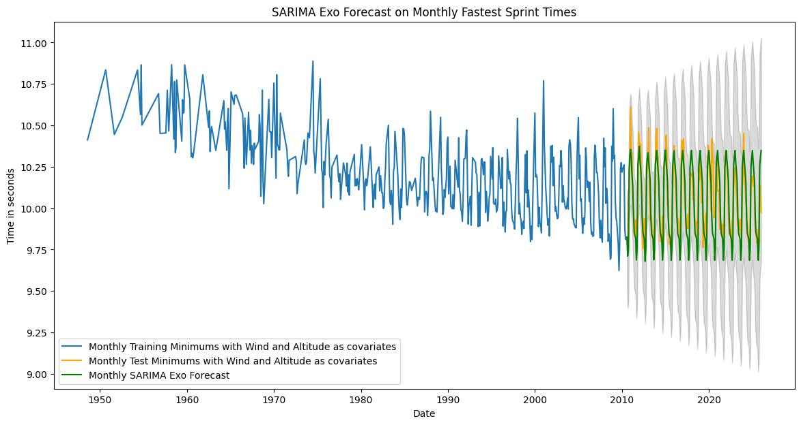

| Differencing Configuration     | Root Mean Squared Error (RMSE)|
| ---------------------- | ---------------------- |
| $D = 1,\ d = 1$ | 0.1860|
| $D = 0,\ d = 0$| 1.086|
| $D = 0,\ d = 1$| 0.2504|
| $D = 1,\ d = 0$| 0.1325|

The final model that was tested was a Recurrent Neural Network using the Long Short Term Memory (LSTM) recurrent layer. A number of different tests were performed to try to optimize the model to produce as low a root mean squared error as possible. The data in question was the weekly fastest times and they were split into 80% training, 10% validation, and 10% testing. The results of those tests and the graph of the model with best performing forecasts are provided below.

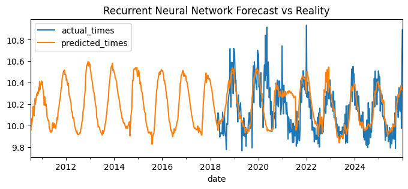

| Test| Key Details/Differences | Root Mean Squared Error (RMSE)|
| ---------------------- | ---------------------- | ---------------------- |
| **1**| **Baseline:** 32 Lags, Hyperbolic Tangent (tanh) activation function, 64 recurrent units, 64 dense units, and refitting was set to *True*.| 0.222
| **2**| Refitting was set to *False*.| 0.295
| **3**| Increased number of recurrent units to $128$ and reverted the previous test.| 0.213 
| **4**| Increased lags to $40$ and reverted the previous tests.| 0.207
| **5**| Added an Exponential Linear Unit activation (elu) function to the recurrent layers and a corresponding $64$ units to that layer. Reverted all previous tests.| 0.174
| **6**| Combination of tests $4$ & $5$.| 0.163
| **7**| Kept the configuration of test $6$ and added $32$ units to the dense layer as a vector: $[64,32]$.| 0.177

***

## Conclusion and Future Study

The primary objective of this report was to attempt to accurately forecast the fastest 100 meter times in relation to the actual times. After creating separate datasets for monthly fastest times and weekly fastest times via resampling and interpolation, Auto Regressive Integrated Moving Average (ARIMA), Seasonal Auto Regressive Integrated Moving Average (SARIMA), and Recurrent Neural Network (RNN) models were fitted onto the datasets. The performances of those models were measured with the Root Mean Squared Error (RMSE) metric. 

After evaluating the performances of all the above models, the univariate SARIMA model with a regular differencing term of $1$ performed the best with an average difference in seconds between the true fastest 100 meter times for each month and the forecasted times of $0.1120$ seconds. This result was a surprise for several reasons as one initial prediction was that the univariate SARIMA model with the seasonal differencing term of $1$ would perform better because the time series had demonstrated seasonal patterns in the autocorrelation. Additionally, the RNN had a larger time series with $4040$ observations, which should've provided the training data to forecast more effectively than the univariate SARIMA model. It's possible that the increase in time interpolation involved with the weekly time series compared to the monthly time series contributed to a higher RMSE.

This project will be reiterated on in the future through more research on improvements for the models in this report, additional models to test on the time series data, and the development of a Bayesian Network. Relevant to the third proposal, a longterm goal of this project is to construct a Bayesian Network to visualize the probability for a sprinter to win a race or major championship race. In the network, each node would represent a different sprinter with their predictors as statistics. These statistics could range from the athlete's season best to the win-loss record versus their competitors. The purpose of the historical data will grow from forecasting future times to ranking sprinters based on multiple predictors.

***

## Appendix

***

### ARIMA Code:
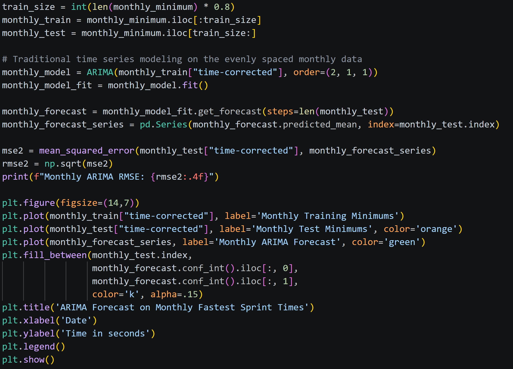

### SARIMA Code:
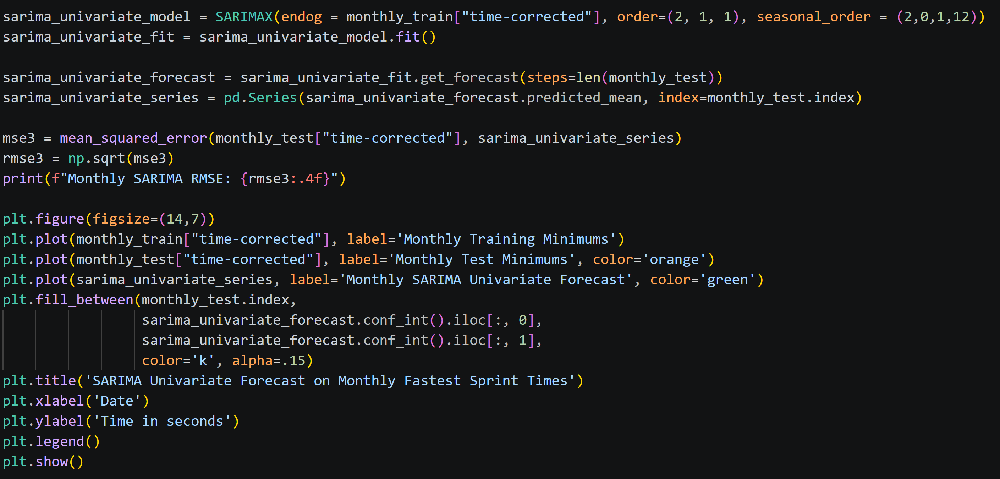

### RNN Code:
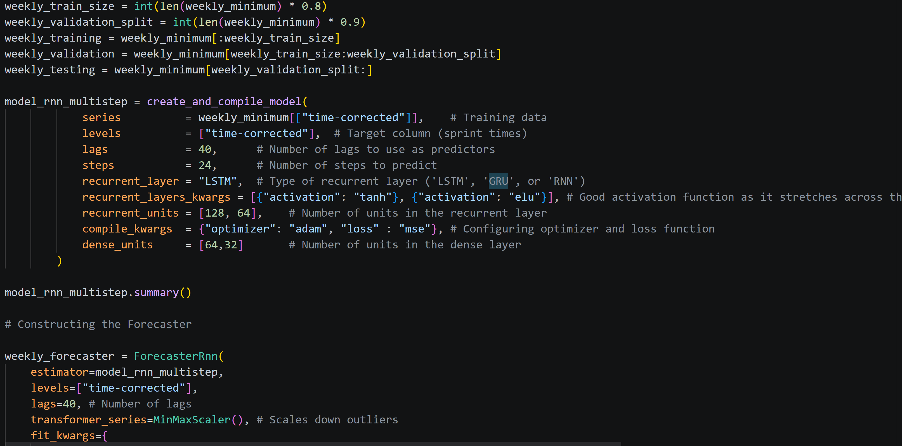
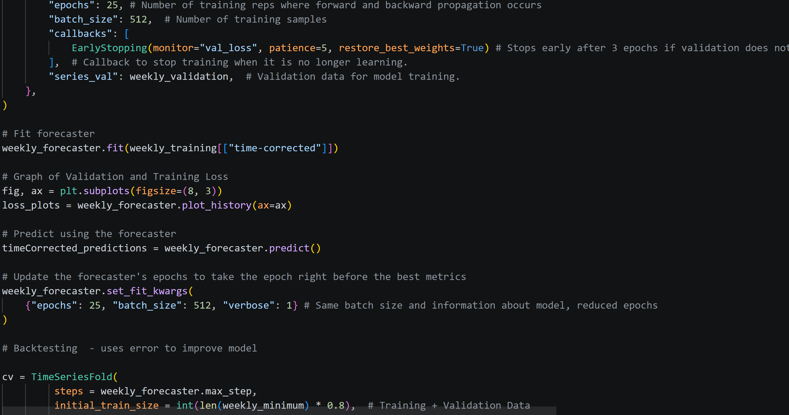
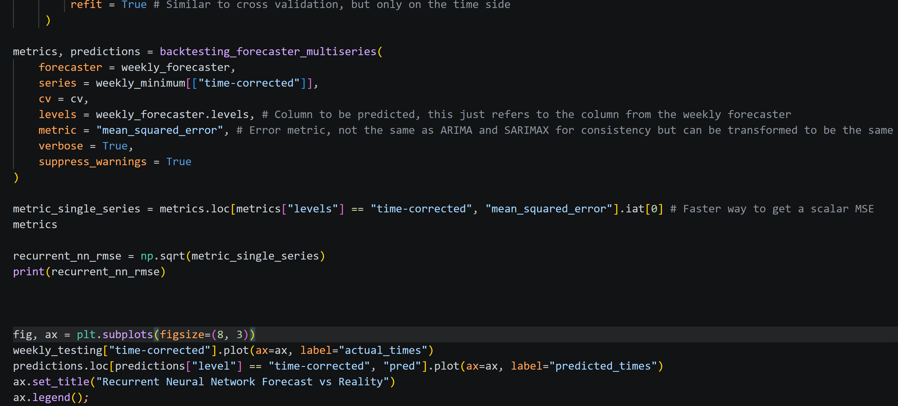

***

## References

[1] Monaco. 2026. *U20 100 Metres Men*: <https://worldathletics.org/records/all-time-toplists/sprints/100-metres/all/men/u20?regionType=countries&region=usa&timing=electronic&windReading=regular&page=1&bestResultsOnly=true&firstDay=1899-12-31&lastDay=2026-06-04&maxResultsByCountry=all&eventId=10229630&ageCategory=u20>  
[2] Texas. Will Grundy. 2026. *UIL State Track and Field State Championships 2025*: <https://tx.milesplit.com/meets/660960-uil-state-track-and-field-state-championships-2025/results/1165932/formatted>  
[3] Mirko Jalava. 2026. *Tilastopaja*: <https://www.tilastopaja.info/>  
[4] Monaco. 19.3.2026. *COMPETITION RULES*: <https://worldathletics.org/about-iaaf/documents/book-of-rules>  
[5] Nicholas P. Linthorne. Brunel University London, Uxbridge, United Kingdom. June 14-18, 2017. *EFFECT OF ALTITUDE ON 100-M SPRINT TIMES: AN ANALYSIS OF RACE
TIMES FROM THE FINALS AT MAJOR CHAMPIONSHIPS*: <https://commons.nmu.edu/cgi/viewcontent.cgi?article=1277&context=isbs>  
[6] Jonas Mureika. *"Back of the envelope" wind and altitude correction for 100 metre sprint times*. 22.6.2000:
<https://arxiv.org/pdf/physics/0006057>  
[7] 2026, *Geocoding API*: <https://geocode.maps.co/>  
[8] Frank Vilzaro Dixon. *Free Elevation API Service*. Switzerland & France. 2024: <https://www.elevation-api.eu/>

